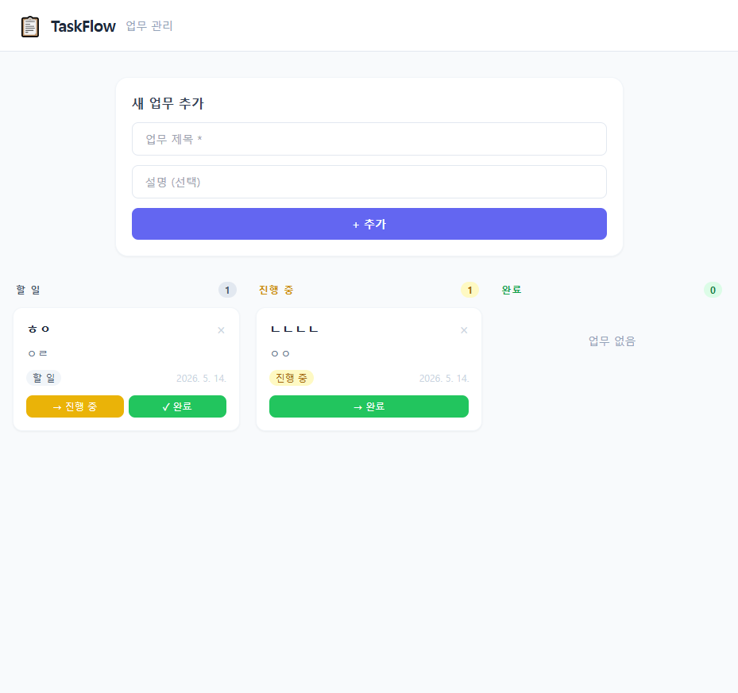
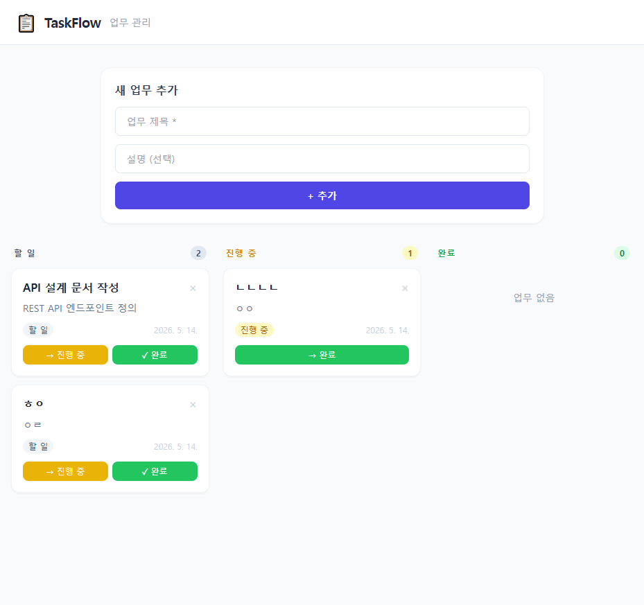
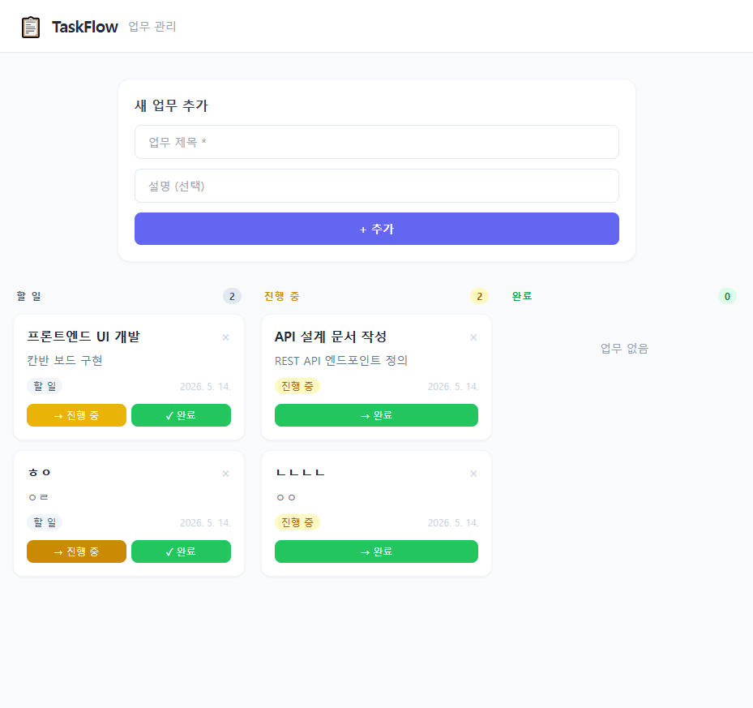
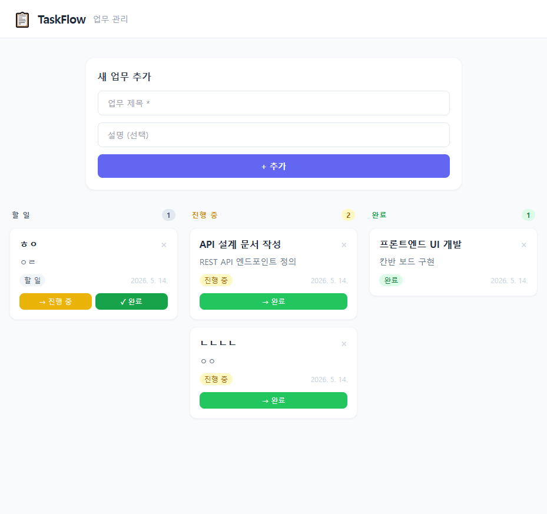
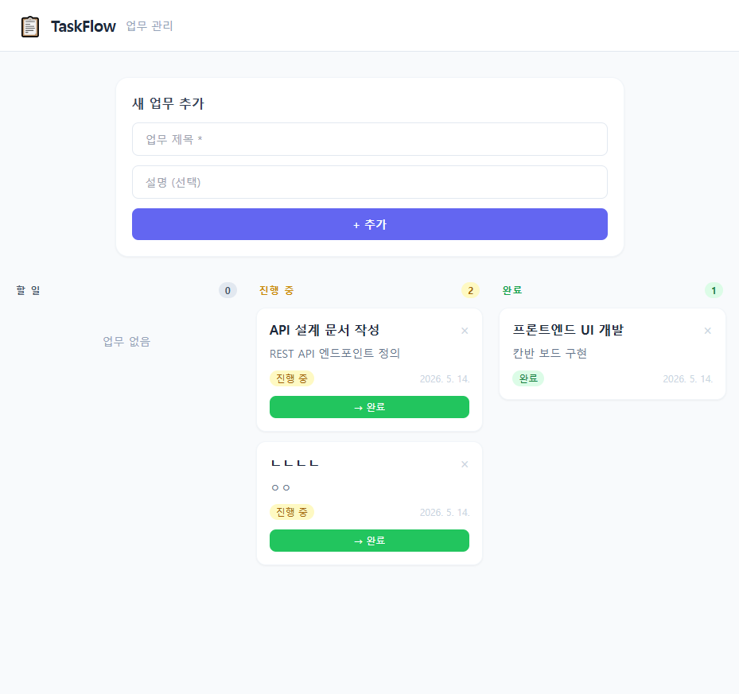

# TaskFlow 테스트 리포트

**테스트 일시:** 2026-05-14  
**테스트 도구:** Playwright MCP  
**대상 URL:** http://localhost:3000 (프론트엔드) / http://localhost:8000 (백엔드 API)

---

## 테스트 결과 요약

| 테스트 케이스 | 결과 |
|---|---|
| TC1 - 초기 화면 렌더링 | ✅ 통과 |
| TC2 - 업무 추가 | ✅ 통과 |
| TC3 - 업무 상태 변경 (할 일 → 진행 중) | ✅ 통과 |
| TC4 - 업무 상태 직행 변경 (할 일 → 완료) | ✅ 통과 |
| TC5 - 업무 삭제 | ✅ 통과 |

**전체: 5/5 통과**

---

## 테스트 케이스 상세

### TC1 - 초기 화면 렌더링

- 칸반 보드 3개 컬럼(할 일 / 진행 중 / 완료) 정상 렌더링 확인
- 업무 추가 폼(제목, 설명) 표시 확인



---

### TC2 - 업무 추가

- 제목: `API 설계 문서 작성`, 설명: `REST API 엔드포인트 정의` 입력 후 추가
- "할 일" 컬럼에 카드 즉시 반영 확인
- POST `/api/tasks` 호출 성공



---

### TC3 - 상태 변경 (할 일 → 진행 중)

- `API 설계 문서 작성` 카드의 `→ 진행 중` 버튼 클릭
- "진행 중" 컬럼으로 카드 이동 확인
- PATCH `/api/tasks/{id}` 호출 성공



---

### TC4 - 상태 직행 변경 (할 일 → 완료)

- `프론트엔드 UI 개발` 카드의 `✓ 완료` 버튼 클릭
- "진행 중" 단계 건너뛰고 "완료" 컬럼으로 이동 확인
- PATCH `/api/tasks/{id}` `status: "done"` 호출 성공



---

### TC5 - 업무 삭제

- `ㅎㅇ` 카드의 `×` 버튼 클릭
- 카드 즉시 제거 확인
- DELETE `/api/tasks/{id}` 호출 성공



---

## 프로젝트 파일 구조

```
taskflow/
├── CLAUDE.md                          # Claude Code 가이드 (프로젝트 규칙)
├── .gitignore                         # Git 제외 파일 설정
│
├── backend/                           # FastAPI 백엔드
│   ├── main.py                        # 앱 진입점, CORS 설정, 라우터 등록
│   ├── database.py                    # SQLite 연결 및 테이블 초기화
│   ├── requirements.txt               # Python 의존성 (fastapi, uvicorn)
│   └── routers/
│       └── tasks.py                   # 업무 CRUD API (/api/tasks)
│
├── frontend/                          # Vanilla JS 프론트엔드
│   ├── index.html                     # 칸반 보드 UI (Tailwind CDN)
│   └── js/
│       └── app.js                     # API 통신 및 DOM 렌더링 로직
│
└── docs/                              # 문서
    ├── test-report.md                 # 테스트 리포트 (현재 파일)
    └── screenshots/                   # 테스트 스크린샷
        ├── 01_initial.png
        ├── 02_add_task.png
        ├── 03_move_to_inprogress.png
        ├── 04_move_to_done.png
        └── 05_delete_task.png
```

---

## API 명세

| 메서드 | 경로 | 설명 |
|--------|------|------|
| GET | `/api/tasks` | 전체 업무 목록 조회 (최신순) |
| POST | `/api/tasks` | 새 업무 생성 |
| PATCH | `/api/tasks/{id}` | 업무 상태 변경 (`todo` / `in_progress` / `done`) |
| DELETE | `/api/tasks/{id}` | 업무 삭제 |

---

## 실행 방법

```powershell
# 백엔드
cd backend
pip install -r requirements.txt
python -m uvicorn main:app --reload

# 프론트엔드 (별도 터미널)
cd frontend
python -m http.server 3000
```
